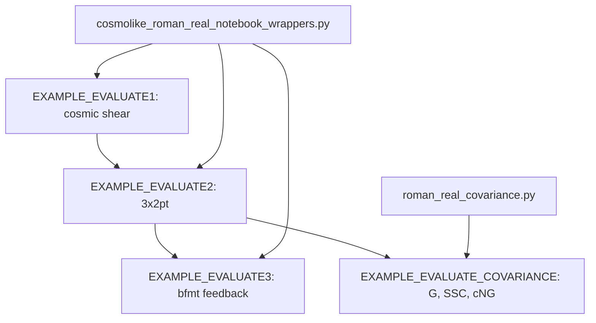

# Table of contents <a name="table_of_contents"></a>

1. [Running Cosmolike projects (Basic instructions)](#roman_running_cosmolike_projects)
2. [Baryonic feedback on EXAMPLE_EVALUATE1](#roman_baryonic_feedback)
3. [Running ML emulators](#roman_examples_emul)
4. [Running Hybrid Cosmolike-ML emulators](#roman_examples_emul2)
5. [Training Roman ML emulators](#roman_train__emul)
6. [Unit tests](#unit_tests)
7. [Computing covariances](#computing_covariances)
8. [Exploring notebooks](#notebooks)
9. [Appendix: Which accuracy settings are available?](#accuracy)

## Running Cosmolike projects (Basic instructions) <a name="roman_running_cosmolike_projects"></a> 

> [!WARNING]
> **CLI for production; notebook wrappers for exploration.**
>
> Run production and HPC calculations from YAML through the optimized
> `_interface` bindings. Notebook `_wrapper` APIs expose intermediate
> quantities for exploration; copying and rearranging their arrays adds
> overhead. Both routes call the same C kernels.
>
> In a matched **LSST Y1 covariance** test on an M2 Pro with eight threads,
> the CLI averaged **50.23 s** (three runs); one wrapper run took **173.38 s**.
> The CLI was **3.45× faster**, with bitwise-identical covariance components.
> See [the production covariance CLI](#computing_covariances).

Also see the documentation for [external baryonic feedback](#roman_baryonic_feedback).

From `Cocoa/Readme` instructions:

> [!Note]
> `setup_cocoa.sh` and `compile_cocoa.sh` install the cosmolike projects that `set_installation_options.sh` selects: a commented `IGNORE_*_CODE` key enables a project, and an active key skips it. The shipped file enables roman_real:
> 
>     [Adapted from Cocoa/set_installation_options.sh shell script]
>     #export IGNORE_COSMOLIKE_LSST_Y1_CODE=1
>     export IGNORE_COSMOLIKE_DES_Y3_CODE=1
>     #export IGNORE_COSMOLIKE_DESXPLANCK_CODE=1
>     export IGNORE_COSMOLIKE_ROMAN_FOURIER_CODE=1
>     #export IGNORE_COSMOLIKE_ROMAN_REAL_CODE=1
>     export IGNORE_COSMOLIKE_ROMAN_KL_CODE=1
>     (...)
>     export ROMAN_REAL_URL="https://github.com/CosmoLike/cocoa_roman_real.git"
>     export ROMAN_REAL_NAME="roman_real"
>     export ROMAN_REAL_GIT_TAG="v5.05"
>
> Each released project is pinned to a tag. To select another revision, set
> only one of its `GIT_COMMIT`, `GIT_BRANCH` or `GIT_TAG` keys: a commit takes
> precedence over a branch, and a branch over a tag.


> [!NOTE]
> If users want to recompile cosmolike, there is no need to rerun the Cocoa general scripts. Instead, run the following three commands:
>
>      source start_cocoa.sh
>
> and
> 
>      source ./installation_scripts/setup_cosmolike_projects.sh
>
> and
> 
>       source ./installation_scripts/compile_all_projects.sh
> 
> or (in case users just want to compile roman_real project)
>
>       source ./projects/roman_real/scripts/compile_roman_real.sh

> [!TIP]
> Assuming Cocoa is installed on a local (not remote!) machine, type the command below after step 2️⃣ to run Jupyter Notebooks.
>
>     jupyter notebook --no-browser --port=8888
>
> The terminal will then show a message similar to the following template:
>
>     (...)
>     [... NotebookApp] Jupyter Notebook 6.1.1 is running at:
>     [... NotebookApp] http://f0a13949f6b5:8888/?token=XXX
>     [... NotebookApp] or http://127.0.0.1:8888/?token=XXX
>     [... NotebookApp] Use Control-C to stop this server and shut down all kernels (twice to skip confirmation).
>
> Now go to the local internet browser and type `http://127.0.0.1:8888/?token=XXX`, where XXX is the previously saved token displayed on the line
> 
>     [... NotebookApp] or http://127.0.0.1:8888/?token=XXX
>
> The project roman_real contains jupyter notebook examples located at `projects/roman_real`.

> [!NOTE]
> The example notebooks load their shared support functions from
> `Cocoa/external_modules/code/cosmolike_core/cosmolike_notebook_utils/`:
> the CAMB run packaged for cosmolike, the data-vector plots, and the
> Fisher-forecast helpers. The notebooks keep only what is specific to
> this project: fiducial values, the compiled-interface calls, and thin
> wrappers binding them to the shared functions.

To run the example

 **Step :one:**: activate the cocoa Conda environment,  and the private Python environment 

      conda activate cocoa

and

      source start_cocoa.sh
 
 **Step :two:**: Select the number of OpenMP cores (below, we set it to 8).

  - Linux
    
        export OMP_NUM_THREADS=8; export OMP_PROC_BIND=close; \
        export OMP_PLACES=cores; export OMP_DYNAMIC=FALSE; \
        export OPENBLAS_NUM_THREADS=1; export MKL_NUM_THREADS=1

  - macOS (arm)
    
        export OMP_NUM_THREADS=8; export OMP_PROC_BIND=disabled; \
        export OMP_PLACES=cores; export OMP_DYNAMIC=FALSE; \
        export OPENBLAS_NUM_THREADS=1; export MKL_NUM_THREADS=1

 **Step :three:**: The folder `projects/roman_real` contains examples. So, run the `cobaya-run` on the first example following the commands below.

> [!Warning] 
> (Linux only) In some HPC nodes, `numa` can cause you problems. If that is the case,
> replace `numa` with `slot`

- **One model evaluation**:

  - Linux

        "${CONDA_PREFIX}"/bin/mpirun -n 1 --oversubscribe \
          --mca pml ob1 --mca btl vader,tcp,self \
          --bind-to core:overload-allowed --report-bindings \
          --rank-by slot --map-by numa:pe=${OMP_NUM_THREADS} \
          cobaya-run ./projects/roman_real/EXAMPLE_EVALUATE1.yaml -f

  - macOS (arm)

         mpirun -n 1 --oversubscribe \
          cobaya-run ./projects/roman_real/EXAMPLE_EVALUATE1.yaml -f

- **MCMC (Metropolis-Hastings Algorithm)**:

  - Linux

        "${CONDA_PREFIX}"/bin/mpirun -n 4 --oversubscribe \
          --mca pml ob1 --mca btl vader,tcp,self \
          --bind-to core:overload-allowed --report-bindings \
          --rank-by slot --map-by numa:pe=${OMP_NUM_THREADS} \
          cobaya-run ./projects/roman_real/EXAMPLE_MCMC1.yaml -f

  - macOS (arm)
     
          mpirun -n 4 --oversubscribe \
            cobaya-run ./projects/roman_real/EXAMPLE_MCMC1.yaml -f


> [!Warning]
> CosmoLike supports the optimized strict-IEEE default build and
> `COSMOLIKE_DEBUG_MODE`. The compiler mode `COSMOLIKE_AGGRESSIVE_MODE`
> is retired because its fast-math configuration produced incorrect
> covariance inverses. Unset that variable before compiling.
> Do not enable `-ffast-math`, `-Ofast`, `-funsafe-math-optimizations`,
> `-fassociative-math`, `-ffinite-math-only`, `-freciprocal-math`,
> `-fno-signed-zeros`, or `-fno-trapping-math` in CosmoLike builds.
> This does not change Cocoa's separate `--aggressive` download option.

# Baryonic feedback on EXAMPLE_EVALUATE1 <a name="roman_baryonic_feedback"></a>

`EXAMPLE_EVALUATE1.yaml` can apply an external baryonic feedback suppression to the
matter power spectrum via the `bfmt` theory block (SP(k), BCEmu, Flamingo, BACCOemu,
or BCemu2025). By default, the example runs without feedback.

**Step :one:**: ensure the lines below are commented out in `set_installation_options.sh`
before running `setup_cocoa.sh` and `compile_cocoa.sh`. *By default, these lines should
be commented out, but it is worth checking*.

      [Adapted from Cocoa/set_installation_options.sh shell script]
      #export IGNORE_PYSPK_CODE=1     # SP(k)
      #export IGNORE_BCEMU_CODE=1     # BCEmu
      #export IGNORE_FBRE_CODE=1      # FlamingoBaryonResponseEmulator
      #export IGNORE_BACCOEMU_CODE=1  # BACCOemu
      #export IGNORE_BFMT_CODE=1      # Baryon Feedback Theory Block

**Step :two:**: in `EXAMPLE_EVALUATE1.yaml`, uncomment the `bfmt` theory block and select
the model:

      theory:
        bfmt:
          baryon_model: 2 # 1 = SP(k), 2 = BCEmu, 3 = FlamingoEmulator, 4 = BACCOemu, 5 = BCemu2025

**Step :three:**: set `external_baryon_suppression: True` on the `roman_real.cosmic_shear`
likelihood block.

**Step :four:**: uncomment the selected model's parameters in the `params` block and in
the `sampler: evaluate: override` block (the example carries a commented block for each
model).

> [!TIP]
> For the sampled parameters of each model, their validity ranges, and the `bfmt`
> options, see `Cocoa/external_modules/code/baryon_suppression/README.md`.

> [!NOTE]
> [EXAMPLE_EVALUATE3.ipynb](EXAMPLE_EVALUATE3.ipynb) runs six of these methods
> (the three SP(k) relations, BCEmu, Flamingo and BCemu2025) through the `bfmt`
> block on the 3x2pt data vector. It needs the packages of the first step above;
> see [Exploring notebooks](#notebooks).

# Running ML emulators <a name="roman_examples_emul"></a>

Cocoa contains a few transformer- and CNN-based neural network emulators capable of simulating the CMB, cosmolike outputs, matter power spectrum, and distances. We provide a few scripts that exemplify their API. To run them, users ensure the following lines are commented out in `set_installation_options.sh` before running the `setup_cocoa.sh` and `compile_cocoa.sh`. By default, these lines should be commented out, but it is worth checking.

      [Adapted from Cocoa/set_installation_options.sh shell script] 
      # insert the # symbol (i.e., unset these environmental keys  on `set_installation_options.sh`)
      #export IGNORE_EMULTRF_CODE=1              #SaraivanovZhongZhu (SZZ) transformer/CNN-based emulators
      #export IGNORE_EMULTRF_DATA=1            
      #export IGNORE_LIPOP_LIKELIHOOD_CODE=1     # to run EXAMPLE_EMUL_(EVALUATE/MCMC/NAUTILUS/EMCEE1).yaml
      #export IGNORE_LIPOP_CMB_DATA=1           
      #export IGNORE_ACTDR6_CODE=1               # to run EXAMPLE_EMUL_(EVALUATE/MCMC/NAUTILUS/EMCEE1).yaml
      #export IGNORE_ACTDR6_DATA=1         
      #export IGNORE_NAUTILUS_SAMPLER_CODE=1     # to run PROJECTS/EXAMPLE/EXAMPLE_EMUL_NAUTILUS1.py
      #export IGNORE_POLYCHORD_SAMPLER_CODE=1    # to run PROJECTS/EXAMPLE/EXAMPLE_EMUL_POLY1.yaml
      #export IGNORE_GETDIST_CODE=1              # to run EXAMPLE_TENSION_METRICS.ipynb
      #export IGNORE_TENSIOMETER_CODE=1          # to run EXAMPLE_TENSION_METRICS.ipynb
      
> [!TIP]
> What if users have not configured ML-related keys before sourcing `setup_cocoa.sh`?
> 
> Answer: Comment the keys below before rerunning `setup_cocoa.sh`.
> 
>     [Adapted from Cocoa/set_installation_options.sh shell script]
>     # These keys are only relevant if you run setup_cocoa multiple times
>     #export OVERWRITE_EXISTING_ALL_PACKAGES=1    
>     #export OVERWRITE_EXISTING_COSMOLIKE_CODE=1 
>     #export REDOWNLOAD_EXISTING_ALL_DATA=1

Now, users must follow all the steps below.

 **Step :one:**: Activate the private Python environment by sourcing the script `start_cocoa.sh`

    source start_cocoa.sh

 **Step :two:**: Ensure OpenMP is **OFF**.

    export OMP_NUM_THREADS=1

 **Step :three:** Run `cobaya-run` on the first emulator example following the commands below.

 - **One model evaluation**:

  - Linux
    
        "${CONDA_PREFIX}"/bin/mpirun -n 1 --oversubscribe \
          --mca pml ob1 --mca btl vader,tcp,self \
          --bind-to core:overload-allowed --report-bindings \
          --rank-by slot --map-by numa:pe=${OMP_NUM_THREADS} \
          cobaya-run ./projects/roman_real/EXAMPLE_EMUL_EVALUATE1.yaml -f

  - macOS (arm)
 
         mpirun -n 1 --oversubscribe \
          cobaya-run ./projects/roman_real/EXAMPLE_EMUL_EVALUATE1.yaml -f

- **MCMC (Metropolis-Hastings Algorithm)**:

  - Linux
    
        "${CONDA_PREFIX}"/bin/mpirun -n 4 --oversubscribe \
          --mca pml ob1 --mca btl vader,tcp,self \
          --bind-to core:overload-allowed --report-bindings \
          --rank-by slot --map-by numa:pe=${OMP_NUM_THREADS} \
            cobaya-run ./projects/roman_real/EXAMPLE_EMUL_MCMC1.yaml -r

  - macOS (arm)

        mpirun -n 4 --oversubscribe \
          cobaya-run ./projects/roman_real/EXAMPLE_EMUL_MCMC1.yaml -r

- **Halofit Comparison**

  The scripts that generated the plots below are provided at `scripts/EXAMPLE_PLOT_COMPARE_CHAINS_EMUL[1-4].py`.

  <p align="center">
  
  </p>

> [!NOTE]
> **Running on more than one node.** The flag `--mca btl vader,tcp,self` works unchanged across
> nodes: Open MPI picks the transport per pair of ranks, using shared memory (`vader`) within a
> node and TCP between nodes. Three things deserve attention on multi-node runs:
>
> 1. **Network interface.** The TCP layer must not select an interface that is not routable
>    between compute nodes. The flag `--mca btl_tcp_if_exclude lo,docker0,virbr0,ib0` excludes
>    the common offenders. TCP bandwidth is not a limitation for our workloads, which exchange
>    small, infrequent MPI messages.
>
> 2. **Environment.** Ranks on remote nodes must see Cocoa's environment (`ROOTDIR`, `PATH`,
>    `LD_LIBRARY_PATH`, `PYTHONPATH`, `CONDA_PREFIX`, the OpenMP/BLAS thread settings, and
>    `CLIK_PATH`/`CLIK_DATA`/`CLIK_PLUGIN`). Slurm forwards the submitting environment
>    automatically; the explicit `-x` flags in our sbatch templates repeat this so the
>    scripts also work under ssh-based launchers. No other Cocoa installation flags are read at runtime.
>
> 3. **Slurm geometry.** Keep `ntasks-per-node` × `cpus-per-task` no larger than the cores per
>    node, and use `--map-by numa:pe=${OMP_NUM_THREADS}` so each rank reserves the cores its
>    OpenMP threads will use.

> [!NOTE]
> **Note on core oversubscription**: an MPI process that is waiting still burns 100% of its
> core, checking for messages in a loop. With more processes than cores, this stalls the
> processes doing real work. Open MPI usually detects this and makes waiting processes give
> up the CPU, but its detection can be fooled. Adding `--mca mpi_yield_when_idle 1` forces
> that behavior; it is harmless otherwise.

- **PolyChord**:

  - Linux
    
        "${CONDA_PREFIX}"/bin/mpirun -n 90 --oversubscribe \
          -x PATH -x LD_LIBRARY_PATH -x PYTHONPATH -x CONDA_PREFIX -x OMP_DYNAMIC \
          -x ROOTDIR -x OMP_NUM_THREADS -x OMP_PROC_BIND -x OMP_PLACES \
          -x CLIK_PLUGIN -x OPENBLAS_NUM_THREADS -x MKL_NUM_THREADS -x CLIK_PATH \
           -x CLIK_DATA --mca mpi_yield_when_idle 1 --rank-by slot --map-by slot \
          --mca pml ob1 --mca btl vader,tcp,self --bind-to core:overload-allowed \
          --mca btl_tcp_if_exclude lo,docker0,virbr0,ib0 --report-bindings \
            cobaya-run ./projects/roman_real/EXAMPLE_EMUL_POLY1.yaml -r

  - macOS (arm)

        mpirun -n 12 --oversubscribe \
          cobaya-run ./projects/roman_real/EXAMPLE_EMUL_POLY1.yaml -r

- **Nautilus**:

  - Linux
    
        "${CONDA_PREFIX}"/bin/mpirun -n 90 --oversubscribe \
          -x PATH -x LD_LIBRARY_PATH -x PYTHONPATH -x CONDA_PREFIX -x OMP_DYNAMIC \
          -x ROOTDIR -x OMP_NUM_THREADS -x OMP_PROC_BIND -x OMP_PLACES \
          -x CLIK_PLUGIN -x OPENBLAS_NUM_THREADS -x MKL_NUM_THREADS -x CLIK_PATH \
           -x CLIK_DATA --mca mpi_yield_when_idle 1 --rank-by slot --map-by slot \
          --mca pml ob1 --mca btl vader,tcp,self --bind-to core:overload-allowed \
          --mca btl_tcp_if_exclude lo,docker0,virbr0,ib0 --report-bindings \
          python -m mpi4py.futures ./projects/roman_real/EXAMPLE_EMUL_NAUTILUS1.py \
            --root ./projects/roman_real/ \
            --outroot "EXAMPLE_EMUL_NAUTILUS1" \
            --maxfeval 750000 \
            --nlive 2048 \
            --neff 15000 \
            --flive 0.01 \
            --nnetworks 5

  - macOS (arm)

        mpirun -n 12 --oversubscribe \
          python -m mpi4py.futures ./projects/roman_real/EXAMPLE_EMUL_NAUTILUS1.py \
            --root ./projects/roman_real/ \
            --outroot "EXAMPLE_EMUL_NAUTILUS1" \
            --maxfeval 750000 \
            --nlive 2048 \
            --neff 15000 \
            --flive 0.01 \
            --nnetworks 5

- **Emcee**:

  - Linux
    
        "${CONDA_PREFIX}"/bin/mpirun -n 51 --oversubscribe \
          -x PATH -x LD_LIBRARY_PATH -x PYTHONPATH -x CONDA_PREFIX -x OMP_DYNAMIC \
          -x ROOTDIR -x OMP_NUM_THREADS -x OMP_PROC_BIND -x OMP_PLACES \
          -x CLIK_PLUGIN -x OPENBLAS_NUM_THREADS -x MKL_NUM_THREADS -x CLIK_PATH \
           -x CLIK_DATA --mca mpi_yield_when_idle 1 --rank-by slot --map-by slot \
          --mca pml ob1 --mca btl vader,tcp,self --bind-to core:overload-allowed \
          --mca btl_tcp_if_exclude lo,docker0,virbr0,ib0 --report-bindings \
          python ./projects/roman_real/EXAMPLE_EMUL_EMCEE1.py \
            --root ./projects/roman_real/ \
            --outroot "EXAMPLE_EMUL_EMCEE1" \
            --maxfeval 1000000

  - macOS (arm)

        mpirun -n 12 --oversubscribe \
          python ./projects/roman_real/EXAMPLE_EMUL_EMCEE1.py \
            --root ./projects/roman_real/ \
            --outroot "EXAMPLE_EMUL_EMCEE1" \
            --maxfeval 1000000


  The number of steps per MPI worker is $n_{\rm sw} =  {\rm maxfeval}/n_{\rm w}$,
  with the number of walkers being $n_{\rm w}={\rm max}(3n_{\rm params},n_{\rm MPI})$.
  For proper convergence, each walker should traverse 50 times the autocorrelation length ($\tau$),
  which is provided in the header of the output chain file. A reasonable rule of thumb is to assume
  $\tau > 200$ and therefore set ${\rm maxfeval} > 10,000 \times n_{\rm w}$.
  Finally, our code sets burn-in (per walker) at $5 \times \tau$.

  With these numbers, users may ask when `Emcee` is preferable to `Metropolis-Hastings`?
  Here are a few numbers based on our `Planck CMB (l < 396) + SN + BAO + LSST-Y1` test case.
  1) `MH` achieves convergence with $n_{\rm sw} \sim 150,000$ (number of steps per walker), but only requires four walkers.
  2) `Emcee` has $\tau \sim 300$, so it requires $n_{\rm sw} \sim 15,000$ when running with $n_{\rm w}=114$.
  
  Conclusion: `Emcee` requires $\sim 3$ more evaluations in this case, but the number of evaluations per MPI worker (assuming one MPI worker per walker) is reduced by $\sim 10$.
  Therefore, `Emcee` seems well-suited for chains where the evaluation of a single cosmology is time-consuming (and there is no slow/fast decomposition).

  What if the user runs an `Emcee` chain with `maxeval` insufficient for convergence? `Emcee` saves the chain checkpoint at `chains/outroot.h5`.

- **Sampler Comparison**

  The scripts that generated the plots below are provided at `scripts/EXAMPLE_PLOT_COMPARE_CHAINS_EMUL[1-4].py`.

  <p align="center">
  
  </p>
  
- **Global Minimizer**:

  Our minimizer is a reimplementation of `Procoli`, developed by Karwal et al (arXiv:2401.14225) 

  - Linux
    
        "${CONDA_PREFIX}"/bin/mpirun -n 51 --oversubscribe \
          -x PATH -x LD_LIBRARY_PATH -x PYTHONPATH -x CONDA_PREFIX -x OMP_DYNAMIC \
          -x ROOTDIR -x OMP_NUM_THREADS -x OMP_PROC_BIND -x OMP_PLACES \
          -x CLIK_PLUGIN -x OPENBLAS_NUM_THREADS -x MKL_NUM_THREADS -x CLIK_PATH \
           -x CLIK_DATA --mca mpi_yield_when_idle 1 --rank-by slot --map-by slot \
          --mca pml ob1 --mca btl vader,tcp,self --bind-to core:overload-allowed \
          --mca btl_tcp_if_exclude lo,docker0,virbr0,ib0 --report-bindings \
          python ./projects/roman_real/EXAMPLE_EMUL_MINIMIZE1.py \
            --root ./projects/roman_real/ \
            --outroot "EXAMPLE_EMUL_MIN1" \
            --nstw 450

  - macOS (arm)

        mpirun -n 12 --oversubscribe \
          python ./projects/roman_real/EXAMPLE_EMUL_MINIMIZE1.py \
            --root ./projects/roman_real/ \
            --outroot "EXAMPLE_EMUL_MIN1" \
            --nstw 450

  The number of steps per Emcee walker per temperature is $n_{\rm stw}$,
  and the number of walkers is $n_{\rm w}={\rm max}(3n_{\rm params},n_{\rm MPI})$.
  The minimum number of total evaluations is $3n_{\rm params} \times n_{\rm T} \times n_{\rm stw}$, which can be distributed among $n_{\rm MPI} = 3n_{\rm params}$ MPI processes for faster results.
    
  The scripts that generated the plots below are provided at `scripts/EXAMPLE_PLOT_MIN_COMPARE_CONV.py`

  <p align="center">
  
  </p>

  In our testing, $n_{\rm stw} \sim 250$ worked reasonably well up to $n_{\rm param} \sim \mathcal{O}(10)$.

- **Profile**: 

  - Linux
    
          "${CONDA_PREFIX}"/bin/mpirun -n 51 --oversubscribe \
            -x PATH -x LD_LIBRARY_PATH -x PYTHONPATH -x CONDA_PREFIX -x OMP_DYNAMIC \
            -x ROOTDIR -x OMP_NUM_THREADS -x OMP_PROC_BIND -x OMP_PLACES \
            -x CLIK_PLUGIN -x OPENBLAS_NUM_THREADS -x MKL_NUM_THREADS -x CLIK_PATH \
             -x CLIK_DATA --mca mpi_yield_when_idle 1 --rank-by slot --map-by slot \
            --mca pml ob1 --mca btl vader,tcp,self --bind-to core:overload-allowed \
            --mca btl_tcp_if_exclude lo,docker0,virbr0,ib0 --report-bindings \
            python ./projects/roman_real/EXAMPLE_EMUL_PROFILE1.py \
              --root ./projects/roman_real/ \
              --cov 'chains/EXAMPLE_EMUL_MCMC1.covmat' \
              --outroot "EXAMPLE_EMUL_PROFILE1" \
              --factor 3 --nstw 450 --numpts 10 \
              --profile 1 \
              --minfile="./projects/roman_real/chains/EXAMPLE_EMUL_MIN1.txt"

  - macOS (arm)

          mpirun -n 12 --oversubscribe \
            python ./projects/roman_real/EXAMPLE_EMUL_PROFILE1.py \
              --root ./projects/roman_real/ \
              --cov 'chains/EXAMPLE_EMUL_MCMC1.covmat' \
              --outroot "EXAMPLE_EMUL_PROFILE1" \
              --factor 3 --nstw 450 --numpts 10 \
              --profile 1 \
              --minfile="./projects/roman_real/chains/EXAMPLE_EMUL_MIN1.txt"

  The argument `factor` specifies the start and end of the parameter being profiled:

      start value ~ minimum value - factor*np.sqrt(np.diag(cov))
      end   value ~ minimum value + factor*np.sqrt(np.diag(cov))

  We advise ${\rm factor} \sim 3$ for parameters that are well constrained by the data when a covariance matrix is provided.
  If `cov` is not supplied, the code estimates one internally from the prior.
  If a parameter is poorly constrained or `cov` is not given, we recommend ${\rm factor} \ll 1$.

  The script of the plot below is provided at `projects/roman_real/scripts/EXAMPLE_PLOT_PROFILE2.py`

  Profile 1: `Cosmic Shear only (plus weak Gaussian priors)`

  <p align="center">
  
  </p>

> [!Warning]
> When running Profiles, you should not set flat priors on parameters that are not well constrained by the data. 
> By doing that, you then risk having the minimizer select values near the boundary of parameter space. This is a big problem when using emulators, as volume near the
> boundary will be inevitable outside the training range. You can convert a flat prior to a Gaussian one by setting the standard deviation to be $\sigma^2 = (hi - lo)^2/12$,
> where $(lo, hi)$ are the flat prior boundaries. In our scripts, we implement a truncated Gaussian prior by adding the following prior block
>
>      prior:
>        # These priors are meant to prevent the sampler to wander far off training
>        g1: "lambda As_1e9: stats.norm.logpdf(As_1e9, loc=2.35, scale=1.6)"
>        g2: "lambda ns: stats.norm.logpdf(ns, loc=0.96, scale=0.05)"
>        g3: "lambda H0: stats.norm.logpdf(H0, loc=70, scale=10.0)"
>        g4: "lambda omegab: stats.norm.logpdf(omegab, loc=0.045, scale=0.012)"
>        g5: "lambda omegam: stats.norm.logpdf(omegam, loc=0.3 , scale=0.25)"
>        g6: "lambda w0pwa: stats.norm.logpdf(w0pwa, loc=-1.0 , scale=1.44)"
>        g7: "lambda w: stats.norm.logpdf(w, loc=-1.0, scale=1.44)"
>        g8: "lambda roman_A1_1: stats.norm.logpdf(roman_A1_1, loc=0, scale=2.5)"
>        g9: "lambda roman_A1_2: stats.norm.logpdf(roman_A1_2, loc=-1.7, scale=2.5)" 
>
> Running Profile also requires emulators trained on larger volumes of the parameter space. 

# Running Hybrid Cosmolike-ML emulators <a name="roman_examples_emul2"></a>

> [!NOTE]
> These hybrid examples remain experimental. The checks below verify the
> workflow; assess emulator accuracy and posterior convergence for your analysis.

The `EXAMPLE_EMUL2` examples emulate the background expansion and matter
power spectra. CosmoLike still computes the survey projections, bias and
intrinsic-alignment contributions. Changing n(z) or nuisance parameters does
not require retraining a survey data-vector network.

The shared theory networks live in `external_modules/data/emultrf`. Install
them through the [main Cocoa emulator recipe](https://github.com/CosmoLike/cocoa#cobaya_base_code_examples_emul2).
These networks assume **mnu = 0.06 eV**; do not sample neutrino mass. Their
cold-matter power approximation is not a calibrated massive-neutrino halo
model. Check their training range before widening cosmological priors.

We assume Cocoa and this project are installed, the Cocoa Conda environment
is active, the shell is Bash, and the current folder is `cocoa/Cocoa/`.

**Step :one:**: activate Cocoa.

```bash
source start_cocoa.sh
```

**Step :two:**: select the OpenMP threads per process.

```bash
export OMP_NUM_THREADS=4
```

**Step :three:**: remove GPU access on Linux; these examples use the CPU.

```bash
export CUDA_VISIBLE_DEVICES=""
```

**Step :four:**: evaluate the first hybrid example.

- Linux

      "${CONDA_PREFIX}"/bin/mpirun -n 1 --oversubscribe \
        --mca pml ob1 --mca btl vader,tcp,self \
        --bind-to core:overload-allowed --report-bindings \
        --rank-by slot --map-by numa:pe=${OMP_NUM_THREADS} \
        cobaya-run ./projects/roman_real/EXAMPLE_EMUL2_EVALUATE1.yaml --force

- macOS (arm)

      mpirun -n 1 --oversubscribe \
        cobaya-run ./projects/roman_real/EXAMPLE_EMUL2_EVALUATE1.yaml --force


The YAML selects the CPU for the distance emulator. Keep BLAS at one thread
per MPI rank (`OPENBLAS_NUM_THREADS=1`, `MKL_NUM_THREADS=1`); on macOS also
use `VECLIB_MAXIMUM_THREADS=1`. The Python sampler entry points set these
BLAS limits before importing numerical libraries.

| Example | Configuration 1 | Configuration 2 |
|---|---|---|
| Fixed evaluation | [EXAMPLE_EMUL2_EVALUATE1.yaml](EXAMPLE_EMUL2_EVALUATE1.yaml) | [EXAMPLE_EMUL2_EVALUATE2.yaml](EXAMPLE_EMUL2_EVALUATE2.yaml) |
| Cobaya MCMC | [EXAMPLE_EMUL2_MCMC1.yaml](EXAMPLE_EMUL2_MCMC1.yaml) | [EXAMPLE_EMUL2_MCMC2.yaml](EXAMPLE_EMUL2_MCMC2.yaml) |
| Annealed minimization | [EXAMPLE_EMUL2_MINIMIZE1.py](EXAMPLE_EMUL2_MINIMIZE1.py) | [EXAMPLE_EMUL2_MINIMIZE2.py](EXAMPLE_EMUL2_MINIMIZE2.py) |
| Parameter profile | [EXAMPLE_EMUL2_PROFILE1.py](EXAMPLE_EMUL2_PROFILE1.py) | [EXAMPLE_EMUL2_PROFILE2.py](EXAMPLE_EMUL2_PROFILE2.py) |
| Nautilus sampling | [EXAMPLE_EMUL2_NAUTILUS1.py](EXAMPLE_EMUL2_NAUTILUS1.py) | [EXAMPLE_EMUL2_NAUTILUS2.py](EXAMPLE_EMUL2_NAUTILUS2.py) |

Configuration **1** uses `roman_real.cosmic_shear`, NLA, and `example1.dataset`.
Configuration **2** uses `roman_real.combo_3x2pt`, NLA, and `example1.dataset`.

The minimization, profile and Nautilus scripts read the corresponding
`EXAMPLE_EMUL2_EVALUATE1.yaml` or `2.yaml`; `--input` selects another evaluate
YAML. They require `cocoa_hybrid_sampling.py` from the matching shared core
revision. They do not maintain separate embedded cosmologies. `--check` evaluates
the specified fiducial and prints the sampled parameter order without sampling.
Use a new `--outroot` for each run; these scripts refuse to overwrite results.

### Cobaya MCMC

With the same CPU environment, run the first MCMC example. Use configuration
2 for the second likelihood listed above. Check chain convergence before
interpreting posterior constraints.

**Step :one:**: start Cobaya's hybrid MCMC.

- Linux

      "${CONDA_PREFIX}"/bin/mpirun -n 2 --oversubscribe \
        --mca pml ob1 --mca btl vader,tcp,self \
        --bind-to core:overload-allowed --report-bindings \
        --rank-by slot --map-by numa:pe=${OMP_NUM_THREADS} \
        cobaya-run ./projects/roman_real/EXAMPLE_EMUL2_MCMC1.yaml

- macOS (arm)

      mpirun -n 2 --oversubscribe \
        cobaya-run ./projects/roman_real/EXAMPLE_EMUL2_MCMC1.yaml


### Minimization, profiles and Nautilus

We assume Cocoa and this project are installed, the Cocoa Conda environment
is active, the shell is Bash, and the current folder is `cocoa/Cocoa/`.

**Step :one:**: check the hybrid setup before a long run.

```bash
python ./projects/roman_real/EXAMPLE_EMUL2_MINIMIZE1.py --check
```

**Step :two:**: search for a minimum with two MPI ranks.

- Linux

      "${CONDA_PREFIX}"/bin/mpirun -n 2 --oversubscribe \
        --mca pml ob1 --mca btl vader,tcp,self \
        --bind-to core:overload-allowed --report-bindings \
        --rank-by slot --map-by numa:pe=${OMP_NUM_THREADS} \
        python ./projects/roman_real/EXAMPLE_EMUL2_MINIMIZE1.py --nstw 200 --outroot hybrid_min1

- macOS (arm)

      mpirun -n 2 --oversubscribe \
        python ./projects/roman_real/EXAMPLE_EMUL2_MINIMIZE1.py --nstw 200 --outroot hybrid_min1


**Step :three:**: profile the first sampled parameter using that saved minimum.

- Linux

      "${CONDA_PREFIX}"/bin/mpirun -n 2 --oversubscribe \
        --mca pml ob1 --mca btl vader,tcp,self \
        --bind-to core:overload-allowed --report-bindings \
        --rank-by slot --map-by numa:pe=${OMP_NUM_THREADS} \
        python ./projects/roman_real/EXAMPLE_EMUL2_PROFILE1.py --profile 0 --nstw 200 --numpts 11 --factor 1 --minfile ./projects/roman_real/chains/hybrid_min1.json --outroot hybrid_profile1

- macOS (arm)

      mpirun -n 2 --oversubscribe \
        python ./projects/roman_real/EXAMPLE_EMUL2_PROFILE1.py --profile 0 --nstw 200 --numpts 11 --factor 1 --minfile ./projects/roman_real/chains/hybrid_min1.json --outroot hybrid_profile1


**Step :four:**: run Nautilus as an independent sampling example.

- Linux

      "${CONDA_PREFIX}"/bin/mpirun -n 2 --oversubscribe \
        --mca pml ob1 --mca btl vader,tcp,self \
        -x PATH -x LD_LIBRARY_PATH -x PYTHONPATH -x CONDA_PREFIX -x ROOTDIR \
        -x OMP_NUM_THREADS -x OMP_PROC_BIND -x OMP_PLACES -x OMP_DYNAMIC \
        -x OPENBLAS_NUM_THREADS -x MKL_NUM_THREADS -x CLIK_PATH -x CLIK_DATA \
        -x CLIK_PLUGIN --mca mpi_yield_when_idle 1 \
        --mca btl_tcp_if_exclude lo,docker0,virbr0,ib0 \
        --bind-to core:overload-allowed --report-bindings \
        --rank-by slot --map-by numa:pe=${OMP_NUM_THREADS} \
        python ./projects/roman_real/EXAMPLE_EMUL2_NAUTILUS1.py --nlive 1000 --neff 10000 --maxfeval 100000 --outroot hybrid_nautilus1

- macOS (arm)

      mpirun -n 2 --oversubscribe \
        python ./projects/roman_real/EXAMPLE_EMUL2_NAUTILUS1.py --nlive 1000 --neff 10000 --maxfeval 100000 --outroot hybrid_nautilus1


The annealed Emcee search follows the DES × Planck template. Its objective
is **−2 log posterior**, including nuisance and cosmological priors; the
profile is therefore a penalized profile, not a pure likelihood profile.
`--nstw` sets steps per walker per temperature. More steps and independent
starts are needed to assess whether a minimum is reliable.

`--profile` accepts a sampled-parameter name or its printed zero-based index.
`--factor` gives the half-width in proposal standard deviations, clipped to
the prior bounds. `--cov` accepts a covariance whose header lists the sampled
parameters in order; without it, the prior covariance sets the proposal.
The minimum JSON must come from the same evaluate YAML and parameter order.
Older plain-text minimum files are not accepted. Set any additional priors
in the input YAML; these scripts do not insert hidden cosmological priors.

Nautilus writes weighted GetDist-compatible rows and a JSON convergence
record. Reaching `--maxfeval` is not convergence. If the budget ends before
any posterior samples are retained, only the checkpoint and a JSON record
with `converged: false` are saved. Its prior transform uses
Cobaya's one-dimensional prior distributions; external prior factors enter
once as additional log weight. Evidence with unnormalized external priors
has that normalization limitation. These examples do not certify emulator
accuracy or posterior convergence.

### Emulator design and optional approximations

Details on the matter power spectrum emulator designs will be presented in the [emulator_code](https://github.com/CosmoLike/emulators_code) repository.

Basically, we apply standard neural network techniques to generalize the *syren-new* Eq. 6 of [arXiv:2410.14623](https://arxiv.org/abs/2410.14623) formula for the linear power spectrum (w0waCDM with a fixed neutrino mass of $0.06$ eV) to new models, extended ranges, or higher precision. Similarly, we use networks to generalize the *syren-Halofit* LCDM nonlinear boost fit (Eq. 11 of [arXiv:2402.17492](https://arxiv.org/abs/2402.17492)).

> [!NOTE]
> Users can decide not to correct the *syren-new* formula for the linear power spectrum (flag in the yaml). Although we have not conducted extensive studies of the caveats of the syren-new approximation, it appears sufficient for w0waCDM forecasts when combined with the Euclid Emulator to compute the nonlinear boost.
>
> For back-of-the-envelope LCDM calculations (e.g., to test cosmolike features), users can also choose not to correct the *syren-Halofit* formula for the LCDM nonlinear boost (see figure below). In this case, the overhead on top of cosmolike computations is minimum, at the order of $0.01$ seconds on a macOS M2Pro laptop.

- **Emulator Comparison**

  The scripts that generated the plots below are provided at `scripts/EXAMPLE_PLOT_COMPARE_CHAINS_EMUL[1-4].py`.

  <p align="center">
  
  </p>


### MPI across nodes

The two-rank commands above disable MPI binding for a portable local run.
For a cluster allocation, use the explicit binding and placement below.

> [!NOTE]
> **Running on more than one node.** With the Open MPI 4 launcher used here,
> `--mca pml ob1 --mca btl vader,tcp,self` selects shared memory within a node
> and TCP between nodes. The same transport list works across nodes.
>
> 1. **Network interface.** TCP must use an interface routable between compute
>    nodes. A common exclusion list is
>    `--mca btl_tcp_if_exclude lo,docker0,virbr0,ib0`; adapt it to the cluster.
>    Keep `ib0` if routable IP-over-InfiniBand is the intended network. These
>    examples exchange parameter vectors and scalar scores, so communication
>    volume is small; actual scaling still depends on the machine.
> 2. **Environment.** Remote ranks need the same Cocoa paths and libraries:
>    `ROOTDIR`, `PATH`, `LD_LIBRARY_PATH`, `PYTHONPATH`, `CONDA_PREFIX`, OpenMP
>    and BLAS settings, and `CLIK_PATH`/`CLIK_DATA`/`CLIK_PLUGIN` when used.
>    Slurm normally exports the submitting environment (`--export=ALL`).
>    Explicit `-x` options also forward these variables with SSH launchers.
>    Activate Cocoa before launching; build/download flags do not replace
>    runtime paths. All nodes must see the same files at the same paths.
> 3. **Slurm geometry.** Keep `ntasks-per-node × cpus-per-task` within the
>    allocated physical cores per node. Set `OMP_NUM_THREADS` to
>    `SLURM_CPUS_PER_TASK` and use `--map-by numa:pe=${OMP_NUM_THREADS}`.
>    The minimization, profile and Nautilus pool reserves one MPI rank as
>    coordinator; the remaining ranks evaluate the model.
>
> Open MPI 5 calls the shared-memory transport `sm`; use `sm,tcp,self` there.
> See the [Open MPI transport guide](https://docs.open-mpi.org/en/main/tuning-apps/networking/shared-memory.html),
> [TCP interface guidance](https://www.open-mpi.org/faq/?category=tcp), and
> [Slurm environment options](https://slurm.schedmd.com/sbatch.html#OPT_export).

Within a Slurm allocation, first activate Cocoa in Bash on the launch node.
The following steps assume Open MPI 4 and shared installation/data paths.
Omit optional CLIK exports if those variables are not set.

**Step :one:**: match OpenMP threads to the scheduler allocation.

```bash
export OMP_NUM_THREADS="${SLURM_CPUS_PER_TASK}"
```

**Step :two:**: bind each OpenMP team to its allocated cores.

```bash
export OMP_PROC_BIND=close
```

**Step :three:**: select core placement.

```bash
export OMP_PLACES=cores
```

**Step :four:**: disable dynamic team resizing.

```bash
export OMP_DYNAMIC=FALSE
```

**Step :five:**: keep OpenBLAS serial.

```bash
export OPENBLAS_NUM_THREADS=1
```

**Step :six:**: keep MKL serial.

```bash
export MKL_NUM_THREADS=1
```

**Step :seven:**: launch the hybrid minimizer across the allocated ranks.

```bash
"${CONDA_PREFIX}"/bin/mpirun -n "${SLURM_NTASKS}" \
  --mca pml ob1 --mca btl vader,tcp,self \
  --mca btl_tcp_if_exclude lo,docker0,virbr0 \
  --map-by numa:pe=${OMP_NUM_THREADS} --bind-to core --report-bindings \
  -x ROOTDIR -x PATH -x LD_LIBRARY_PATH -x PYTHONPATH -x CONDA_PREFIX \
  -x OMP_NUM_THREADS -x OMP_PROC_BIND -x OMP_PLACES -x OMP_DYNAMIC \
  -x OPENBLAS_NUM_THREADS -x MKL_NUM_THREADS -x CUDA_VISIBLE_DEVICES \
  python ./projects/roman_real/EXAMPLE_EMUL2_MINIMIZE1.py --nstw 200 --outroot hybrid_multinode
```

For a Planck likelihood add `-x CLIK_PATH -x CLIK_DATA -x CLIK_PLUGIN` when
those variables are defined. Follow the cluster's MPI module and Slurm
launch policy; do not oversubscribe a production allocation. Outside Slurm,
supply the hosts and slots with the cluster's `--hostfile` or `--host` recipe.

# Training Roman ML emulators <a name="roman_train__emul"></a>

Emulators for Roman are stored on `emulators/`, we usually provide the YAML files used to train them. For example, datavectors required to train an emulator 
with settings similar to

    nla_cosmic_shear/w0wa_takahashi_cs_cnn.h5
    nla_cosmic_shear/w0wa_hmcode2020_cs_cnn.h5

can be found at

    nla_cosmic_shear/w0wa_takahashi_cs_cnn.yaml

The repository `emulators_code` provides the script `dataset_generator_lensing.py` that can generate data vectors for any cosmological project. 

## Compute data vectors to train a cosmic shear data vector emulator

   The script below computes data vectors for cosmic shear (NLA, $w_0w_a$ model, and Halofit).

    "${CONDA_PREFIX}"/bin/mpirun -n 10 --oversubscribe \
    -x PATH -x LD_LIBRARY_PATH -x PYTHONPATH -x CONDA_PREFIX -x OMP_DYNAMIC \
    -x ROOTDIR -x OMP_NUM_THREADS -x OMP_PROC_BIND -x OMP_PLACES \
    -x CLIK_PLUGIN -x OPENBLAS_NUM_THREADS -x MKL_NUM_THREADS -x CLIK_PATH \
     -x CLIK_DATA --mca mpi_yield_when_idle 1 --rank-by slot --map-by slot \
    --mca pml ob1 --mca btl vader,tcp,self --bind-to core:overload-allowed \
    --mca btl_tcp_if_exclude lo,docker0,virbr0,ib0 --report-bindings \
    python external_modules/code/emulators/emultrf/emultraining/dataset_generator_lensing.py \
      --root projects/roman_real/  \
      --fileroot emulators/nla_cosmic_shear/ \
      --nparams 10000 \
      --yaml 'w0wa_takahashi_cs_cnn.yaml' \
      --datavsfile 'w0wa_takahashi_dvs_train' \
      --paramfile 'w0wa_takahashi_params_train' \
      --failfile  'w0wa_takahashi_params_failed_train' \
      --chain 0 \
      --unif 0 \
      --temp 64 \
      --maxcorr 0.15 \
      --freqchk 2000 \
      --loadchk 0 \
      --append 1

- The requested number of data vectors is given by the `--nparams` flag.

- There are two possible samplings.
  - The option `--unif 1` sets the sampling to follow a uniform distribution (respecting parameter boundaries set in the YAML file)
  - The option `--unif 0` sets the sampling to follow a Gaussian distribution with the following options
    -  The covariance matrix is set in the YAML file (keyword `params_covmat_file` inside the `train_args` block).
       For example, our provided YAML selects the Fisher-based *w0wa_fisher_covmat.txt* covariance matrix
    -  Temperature reduces the curvature of the likelihood (`cov = cov/T`) and is set by `--temp` flag 
    -  The correlations of the original covariance matrix are reduced to be less than `--maxcorr`.

- For visualization purposes, setting `--chain 1` sets the script to generate the training parameters without computing the data vectors.

- The output files are

      # Distribution of training points ready to be plotted by GetDist
      w0wa_params_train_cs_64.1.txt
      w0wa_params_train_cs_64.covmat
      w0wa_params_train_cs_64.paramnames
      w0wa_params_train_cs_64.ranges

      #Corresponding data vectors
      w0wa_takahashi_nobaryon_dvs_train_cs_64.npy
      # Training parameters in which the data vector computation failed
      w0wa_params_failed_train_cs_64.txt

- The flags `--freqchk`, `--loadchk`, and `--append` are related to checkpoints. 
  - The option `--freqchk` sets the frequency at which the code saves checkpoints (chk).
  - The options `--loadchk` and `--append` specify whether the code loads the parameters and data vectors from a chk.
    In the two cases below, the code determines which remaining data vectors to compute based on the flags saved in the `--failfile` file.
      - Case 1 (`--loadchk 1` and `--append 1`): the code loads params from the chk and appends `~nparams` models to it. 
      - Case 2 (`--loadchk 1` and `--append 0`): the code loads the params.

 

# Unit tests <a name="unit_tests"></a>

The `tests/` folder holds unit tests for the likelihoods of this
project: they compare each likelihood against stored reference
values, check for race conditions from OpenMP threading, measure
the numerical error of the default accuracy settings, and check the
halo-model code behind the `include_HOD_GX` and `include_halo_IA`
likelihood keys. The tests read nothing from the live project;
[tests/README.md](tests/README.md) describes every test, the tests'
own data snapshot, and how to refresh it.

We assume users are in the Conda cocoa environment from a previous
`conda activate cocoa` command, that the shell is bash, and that the
current folder is the cocoa main folder `cocoa/Cocoa`.

**Step :one:**: activate the private Python environment by sourcing
the script `start_cocoa.sh`

    source start_cocoa.sh

**Step :two:**: run the tests of this project

    python -m pytest ./projects/roman_real/tests/data_vector

## Minimum accuracy parameters

The advisory checks in `tests/data_vector/test_accuracy.py` measure the
numerical error of the default accuracy settings: each setting is
raised one at a time on the 3x2pt configuration, so a large
$\Delta\chi^2$ can be attributed to the setting causing it, and
then every setting at once.

Each check prints the $\Delta\chi^2$ between the high-accuracy
and the default evaluations, to compare against the 0.2 band the
reference tests allow. No measured values are quoted here: rerun
the checks to measure them on the current code, and see
[tests/README.md](tests/README.md) for each check, the settings
raised, and what each setting controls.

# Exploring notebooks <a name="notebooks"></a>

**Armadillo** was chosen to make a convenient Python API for notebook
exploration. This C++ library provides vectors, matrices and three-dimensional
arrays called cubes. A small interface layer connects them to NumPy through
**pybind11**, with **CARMA** handling array conversion. The notebooks expose
intermediate quantities; production calculations use the CLI interfaces.

We assume Cocoa and this project are installed, the Cocoa Conda environment
is active, the shell is Bash, and the current folder is `cocoa/Cocoa/`.

Compile the project first; the covariance notebook also needs the optional
covariance build described [below](#computing_covariances).

**Step :one:**: activate Cocoa.

```bash
source start_cocoa.sh
```

**Step :two:**: select the OpenMP team.

```bash
export OMP_NUM_THREADS=8
```

**Step :three:**: start Jupyter.

```bash
jupyter notebook --no-browser --port=8888
```

**Step :four:**: open the printed URL and choose a notebook below.

**Step :five:**: select **Kernel → Restart Kernel and Run All Cells**.

| Notebook | Contents |
|---|---|
| [EXAMPLE_EVALUATE1.ipynb](EXAMPLE_EVALUATE1.ipynb) | Cosmic shear of `EXAMPLE_EVALUATE1.yaml`: how $`C_\ell^{EE}`$ and $`\xi_\pm`$ respond to cosmology, intrinsic alignment, angular binning, tabulated hydrodynamical feedback and accuracy settings; the likelihood $`\chi^2`$, halofit against EuclidEmulator2, Fisher forecasts, and the wavenumbers each measurement responds to. |
| [EXAMPLE_EVALUATE2.ipynb](EXAMPLE_EVALUATE2.ipynb) | Galaxy–galaxy lensing and clustering of the 3x2pt example `EXAMPLE_EVALUATE2.yaml`: $`C_\ell^{gs}`$, $`\gamma_t`$, $`C_\ell^{gg}`$ with and without the Limber approximation, $`w(\theta)`$, tabulated hydrodynamical feedback, accuracy settings, the 3x2pt $`\chi^2`$, and halofit against EuclidEmulator2. |
| [EXAMPLE_EVALUATE3.ipynb](EXAMPLE_EVALUATE3.ipynb) | Baryonic feedback from the `bfmt` theory block: six methods applied to the 3x2pt data vector, the $`\chi^2`$ of each prediction against the stored data vector, the table `chains/EXAMPLE_EVALUATE3.datavectors`, and one-parameter sweeps of each method's suppression. |
| [EXAMPLE_EVALUATE_COVARIANCE.ipynb](EXAMPLE_EVALUATE_COVARIANCE.ipynb) | G, SSC, cNG, total, separate 1h–4h matter trispectra and matrix diagnostics. |

> [!NOTE]
> `EXAMPLE_EVALUATE3.ipynb` needs the `bfmt` packages of the
> [baryonic feedback section](#roman_baryonic_feedback). Its parameter
> sweeps run CAMB about 130 times and take tens of minutes.

The three data-vector notebooks call the wrappers in
`interface/cosmolike_roman_real_notebook_wrappers.py`; the covariance
notebook calls the survey adapter `covariance/roman_real_covariance.py`.
Read the notebooks in this order:



Choose the Python kernel from the activated Cocoa environment and restart it
after recompiling. The [covariance guide](covariance/README.md) explains the
forecast files, figures and refinement workflow.


# Computing covariances <a name="computing_covariances"></a>

The production CLI saves G, SSC, cNG and total before scale cuts. It reads
[the covariance evaluate YAML](EXAMPLE_EVALUATE_COVARIANCE.yaml) and calls the shared C kernels.

We assume Cocoa and this project are installed, the Cocoa Conda environment
is active, the shell is Bash, and the current folder is `cocoa/Cocoa/`.

**Step :one:**: enable this project in `set_installation_options.sh` by commenting out
`export IGNORE_COSMOLIKE_ROMAN_REAL_CODE=1` before activation.

**Step :two:**: activate Cocoa.

```bash
source start_cocoa.sh
```

**Step :three:**: enable covariance generation.

```bash
unset IGNORE_COSMOLIKE_ROMAN_REAL_COVARIANCE
```

**Step :four:**: compile the project.

```bash
source ./projects/roman_real/scripts/compile_roman_real.sh
```

**Step :five:**: set the OpenMP team size.

```bash
export OMP_NUM_THREADS=8
```

**Step :six:**: compute the fixed YAML cosmology.

```bash
python ./projects/roman_real/covariance/compute_covariance.py ./projects/roman_real/EXAMPLE_EVALUATE_COVARIANCE.yaml
```

Use `--output PATH` for a separate output or `--overwrite` to replace an
existing computed archive. Paths are relative to `cocoa/Cocoa/`. Threads
come only from `OMP_NUM_THREADS`, never from the YAML; the runner fixes BLAS
to one thread. Ordinary likelihoods read their supplied covariance and do
not generate a new one.

Cobaya's YAML reader supplies the familiar `theory`, `params` and
`sampler: evaluate` syntax. This runner evaluates one fixed cosmology and
does not run MCMC. See the [covariance guide](covariance/README.md) for output
ordering, physics, Gaussian non-Limber/IA limits, plots and test commands,
and the [accuracy FAQ](#accuracy) for the separate numerical controls.


# Appendix <a name="appendix"></a>

## FAQ: Which accuracy settings are available? <a name="accuracy"></a>

Data-vector options belong to the selected `likelihood` block. Covariance
options belong to the evaluate YAML's `covariance` block. They use separate
names and settings; changing one does not refine the other.

| Data-vector setting | What it changes |
|---|---|
| `accuracyboost` | Overall interpolation-table resolution. |
| `integration_accuracy` | Quadrature resolution; refine independently of interpolation. |
| `internal_accuracyboost` | C-FAST-PT convolution grid. |
| `nonlimber_accuracyboost` | Non-Limber distance sampling. |
| `pk_z_refinement` | Nested redshift refinement of matter-power inputs. |
| `lmax` | Real-space angular-transform cutoff, where a real-space transform is used. |
| `kmax_boltzmann` | Requested Boltzmann power range; coordinate it with the theory settings. |

`adopt_limber_gg` and `adopt_limber_gs` choose a projection approximation.
`photoz_interpolation_type` chooses how n(z) is interpolated, while
`photoz_zmid_convention` describes the input coordinates. These are modeling
or input-convention choices, not interchangeable accuracy boosts.

The default data-vector power grid has 1,500 wavenumbers at boost 1.
Covariance alone uses `power_accuracyboost: 8` to prepare 11,993 nodes by
natural cubic interpolation before C linear lookup. Its `accuracy_boost`
refines tables and cutoffs; its `integration_accuracy` independently selects
quadrature levels 0–4. See the complete [covariance accuracy table](covariance/README.md#accuracy-settings).

CAMB's `theory.camb.extra_args.AccuracyBoost` controls CAMB, not CosmoLike.
Check interpolation, quadrature, input-power sampling and transform cutoffs
separately at fixed cosmology and measurement bins. Narrow n(z) overlaps
particularly require a quadrature check; increasing `accuracyboost` alone
is not that check. The [data-vector test guide](tests/data_vector/README.md)
and [covariance test guide](tests/covariance/README.md) state what each set of
tests actually verifies. A passing regression or a larger boost is not a general
claim of survey or Fisher convergence.
