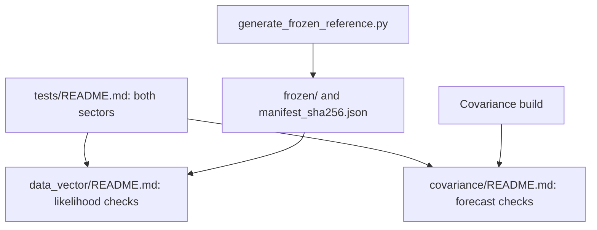

# Tests

The Roman real tests are divided into two sectors.

- [Data-vector and likelihood checks](data_vector/README.md) cover the project
  predictions, frozen inputs and numerical diagnostics.
- [Covariance checks](covariance/README.md) cover forecast assembly and its
  documented component checks. Covariance generation must be compiled.

Read this page, then the guide of each sector. The stored snapshot under
`frozen/` feeds the data-vector checks; the covariance checks need the
covariance build:



We assume Cocoa and this project are installed, the Cocoa Conda environment
is active, the shell is Bash, and the current folder is `cocoa/Cocoa/`.

Run the sectors in separate Python invocations: they initialize different
compiled-library state. Running one project at a time also avoids importing
another project's same-named test helpers.

**Step :one:**: activate Cocoa.

```bash
source start_cocoa.sh
```

**Step :two:**: run the data-vector sector.

```bash
python -m pytest ./projects/roman_real/tests/data_vector
```

**Step :three:**: enable covariance generation.

```bash
unset IGNORE_COSMOLIKE_ROMAN_REAL_COVARIANCE
```

**Step :four:**: compile the project.

```bash
source ./projects/roman_real/scripts/compile_roman_real.sh
```

**Step :five:**: run the covariance sector.

```bash
python -m pytest ./projects/roman_real/tests/covariance
```

The project must be enabled in `set_installation_options.sh` before
activation. A covariance skip in a deliberately disabled build is expected;
it is not a successful covariance check. Read the sector guide to distinguish
asserted regressions from advisory accuracy reports.

Frozen configurations and inputs are protected by `manifest_sha256.json`.
Do not regenerate references to silence an unexplained failure. The sector
guides document the deliberate reference-update procedure and its limits.

Hybrid examples can be checked without sampling:

**Step :one:**: check configuration 1.

```bash
python ./projects/roman_real/EXAMPLE_EMUL2_MINIMIZE1.py --check
```

**Step :two:**: check configuration 2.

```bash
python ./projects/roman_real/EXAMPLE_EMUL2_MINIMIZE2.py --check
```
